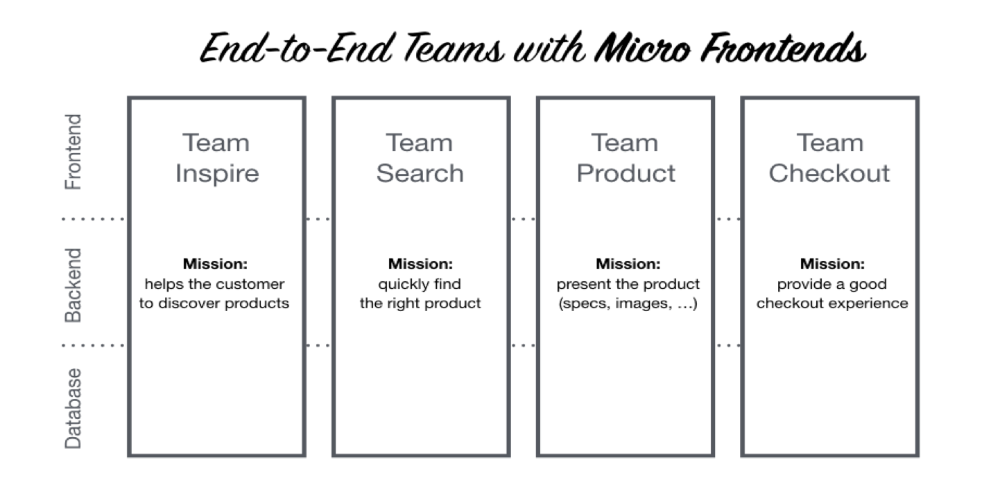
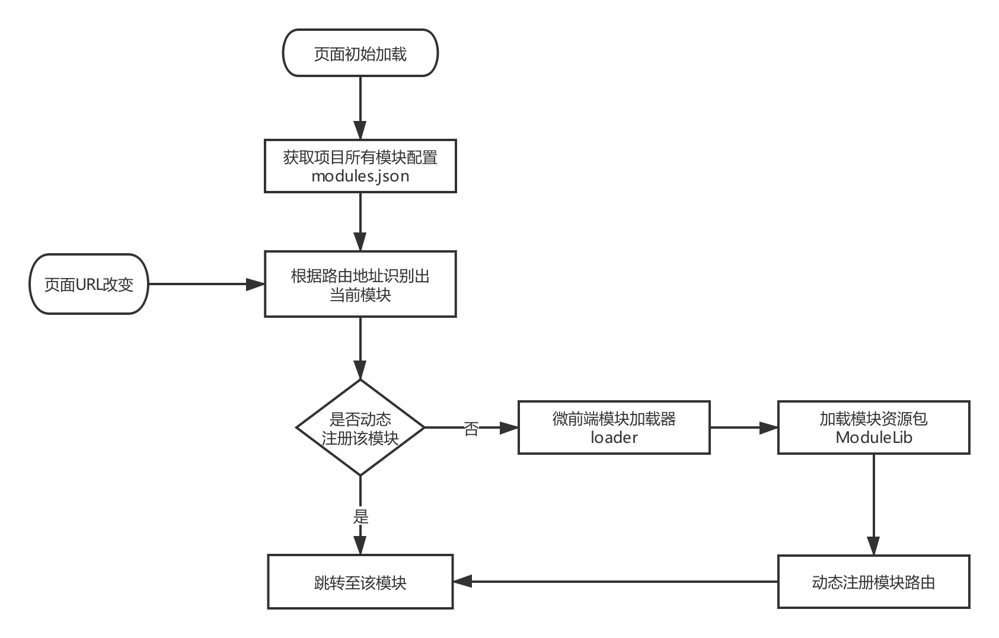

## react-microfrontends-boilerplate (基于React的微前端框架)

微前端是一种类似于微服务的架构，由Thoughtworks公司在2016年其技术雷达期刊中首次提出。它将微服务的理念应用于浏览器端，即将 Web 应用由单一的单体应用转变为**多个小型前端应用聚合为一的应用**。各个前端应用还可以**独立运行**、**独立开发**、**独立部署**。



**目录**

- [微前端的使用场景](#微前端的使用场景)
- [微前端的设计理念](#微前端的设计理念)
- [实战微前端架构设计](#实战微前端架构设计)
- [react-microfrontends-boilerplate](#react-microfrontends-boilerplate)

## 微前端的使用场景

与后端微服务架构用来接耦服务间的依赖所不同，微前端架构主要解决前端应用如何优雅的聚合问题，这类问题随着项目复杂度、产品模块的不断增加越来越明显。

- 产品的业务模块逐渐增多，项目越来越庞大，迭代开发出现大量分支且容易混乱、代码合并经常冲突等，变得难以维护。
- 多个开发团队并行开发同一个产品，测试、部署与发布时协调沟通成本增大，希望拆分成子应用，每个团队专心负责自己的功能模块。
- 前端项目中的业务模块存在耦合现象，需要调整架构约束开发，甚至模块化拆分。

如果你遇到上面某种场景的话，那么是时候对前端应用采用微前端架构，进行微服务化拆分了。


## 微前端的设计理念

- ### 中心化路由
  对于后端微服务架构来说，需要一个服务注册中心，实现功能：

  服务提供方需要注册服务的地址，服务调用方根据服务的地址，找到目标服务。

  对于微前端架构来说，这个地址就是路由。

  **所以中心化路由，需要注册每个前端应用（模块）的路由地址。**

  
  
- ### 标识化应用

  每个前端应用（模块）的标识必须是唯一：
  
  **唯一的应用名称ModuleName**，例如用户模块 user-module
  
  **唯一的路由前缀RoutePrefix**，例如用户模块的路由前缀 /user
  
  
  
- ### 生命周期

  微前端架构有一个基本的生命周期：
  
  （1）根据访问URL自动识别前端应用
  
  （2）获取到前端应用的配置信息
  
  （3）根据前端应用配置信息，获取到资源文件
  
  （4）动态注册前端应用（路由、状态管理等）


- ### 独立部署与配置自动化

	微前端应用有一套独立的开发机制：前端应用独立运行（Run）、独立打包（Package）、自动更新（Upgrade）


## 实战微前端架构设计

基于上面的设计理念，设计了微前端架构的工作流程，如下：




## react-microfrontends-boilerplate使用

- ### 克隆项目

  ```
  git clone https://github.com/looeychen/react-microfrontends-boilerplate.git
  ```

- ### 新增模块

  在micro-modules/repos目录下，提供了两种模块示例、模块清单文件。

  （1）单git仓库存储一个模块：single-module-example

  （2）单git仓库存储多个模块：multi-module-example

  （3）模块清单文件manifest.json仅仅作为标识该项目存在哪些模块，便于管理维护。
  
  
  
- ### 配置模块
  
  在micro-modules目录下的modules.json（开发环境下项目所有模块的配置文件），当新增/删除/修改模块时需同步更新。系统默认读取modules.json的地址是：/micro-modules/modules.json，在config.js文件里配置。

  
  moduleName需要带上路径信息，如下
  
  ```
  [
    {
      "moduleName": "multi-module-example/modules/material-manage",
      "modulePath": "/material-manage"
    },
    {
      "moduleName": "multi-module-example/modules/menu-manage",
      "modulePath": "/menu-manage"
    }
  ]
  ```

  
- ### 构建模块

  根据modules.json的模块名称moduleName进行构建

  ```
    npm run build:micromodule -- --microModule single-module-example
  ```

  模块构建完成会输出到dist目录下的micro-modules目录，同时自动生成或刷新生产环境下的modules.json文件

  ```
  [
    {
      "moduleName": "single-module-example",
      "modulePath": "/user",
      "moduleMd5Version": "3282b8e2",
      "moduleHasCssFile": true
    },
    {
      "moduleName": "multi-module-example/modules/material-manage",
      "modulePath": "/material-manage",
      "moduleMd5Version": "b882d0d3",  //模块构建后lib文件的md5值
      "moduleHasCssFile": true
    },
    {
      "moduleName": "multi-module-example/modules/menu-manage",
      "modulePath": "/menu-manage",
      "moduleMd5Version": "697b5014",
      "moduleHasCssFile": true
    }
  ]
  ```

- ### 运行项目

	开发环境
	
  ```
	npm run dev
  ```
  
  生产环境
  
  ```
  npm run build
  npm run prod

  ```
